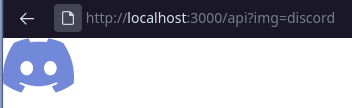
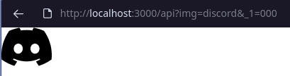

# SVG Image API

Get SVG images with custom images

## API in action

Discord in default color

Discord in black color

Tux in default colors

Tux in [Catppuccin](https://github.com/catppuccin/catppuccin)

## TODOS

- Get heroku to work
- Add more SVGs
- Documentation
